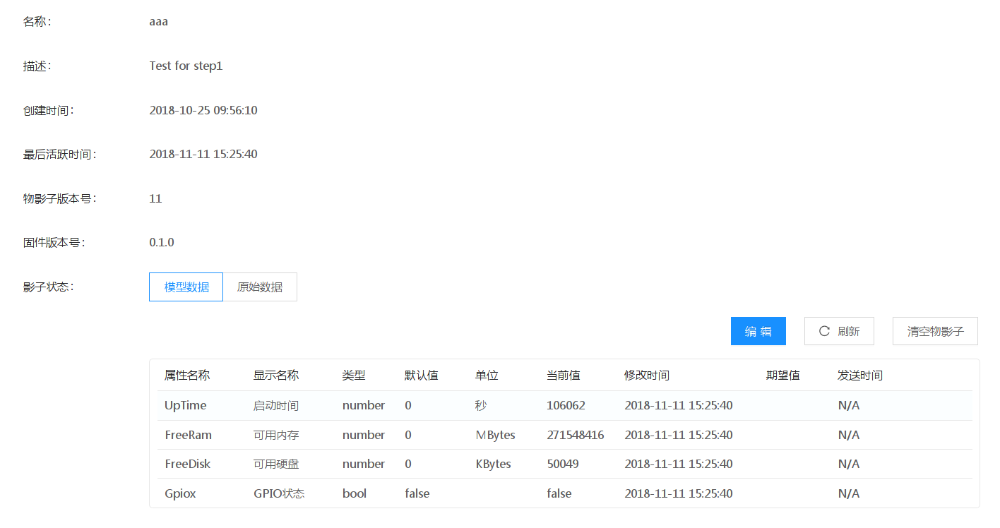

百度云验证测试
---

#### 百度云服务器产品创建以及配置
参考百度云服务器介绍文档在云服务器侧完成产品创建以及参数配置即可

在服务器侧可以添加'物影子信息'如下图,本步骤非必须是可选进行:

注意,如果要测试物影子功能,并且使用CYUN SDK更新物影子状态,上图中属性名称一列必须和上图中严格保持一致,包括大小写

---
#### 测试PC侧（模拟物联网设备）配置修改

    cd bin/baidu/config
    参考下面图片修改此目录下的qyun文件

| 配置文档条目     | 条目含义　　 | 百度云对应字段  | 取值  | 说明               |
| -------------- | ----------- | ------------- | ---------------- | ------------------- |
| curpdt         | 当前使用的产品名称 | 物模型名称  | 参考云服务器定义 | 人可读名称      |
| productkey     | 当前使用的产品ID | name中/之前的部分  | 参考云服务器定义  | 产品名称数字化      |
| productsecrt   | NA       | NA   | NA  | NA |
| deviceid       | 每个设备的唯一标识符  | name中/之后的部分 | 参考云服务器定义  |百度云中，物模型是一个产品的概念，物影子是每个设备实体 |
| devicesecrt    | 每个设备连接服务器的秘钥(证书) | key  | 参考云服务器定义 | 设备秘钥 |

---
#### 测试PC侧（模拟物联网设备）程序运行

    cd bin/baidu/bin
    ./tryit.sh

tryit.sh　脚本会自动调用qyunali应用程序使用conf目录下的qyun作为配置文件连接百度天工云服务器

---
#### 百度云服务器产品状态检查

设备侧连接成功后,可以在服务器侧检查测试设备的状态信息如下图

